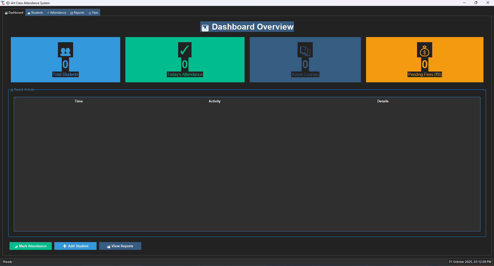
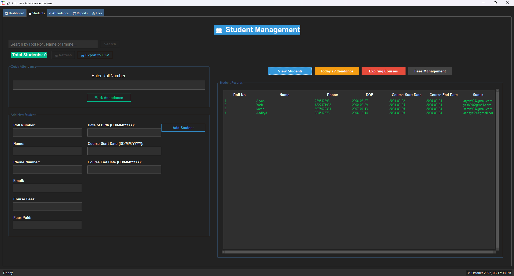
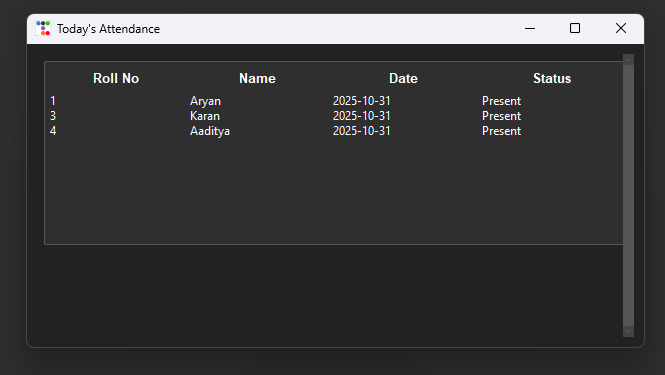
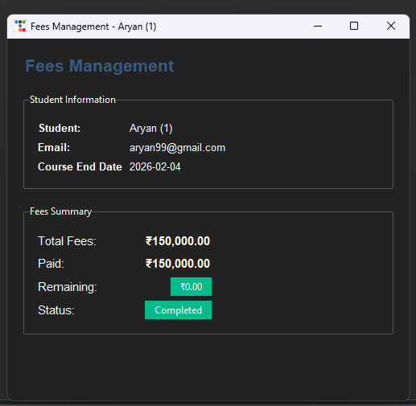
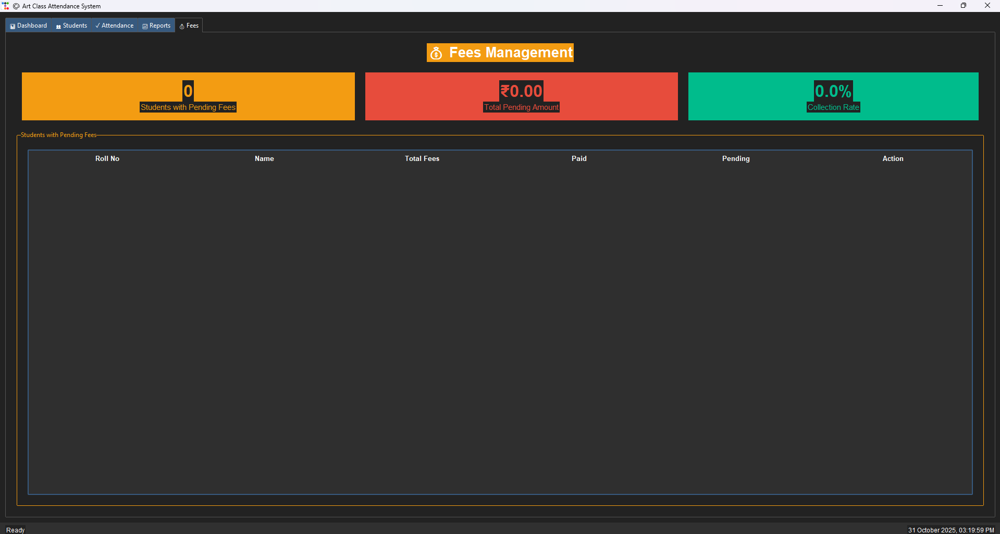
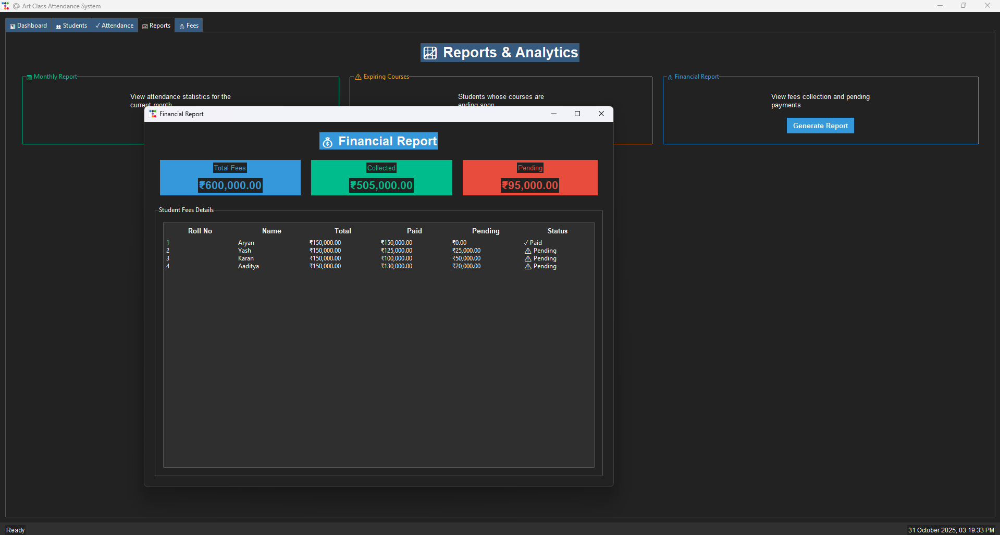

# 🎨 Art Class Attendance & Management System

## Enterprise-Grade Solution for Art Education Institutions

A comprehensive **Art Class Attendance & Management System** designed to streamline administrative workflows for art education providers. Built with Python and SQLite, this robust solution offers a modern tabbed interface with real-time analytics, professional payment tracking, and comprehensive reporting capabilities.

### ✨ What's New in Version 2.0

- **📊 Interactive Dashboard** with live statistics and recent activity
- **🎯 Modern Tabbed Interface** for organized workflow
- **💰 Enhanced Fees Management** with payment tracking and receipts
- **📈 Advanced Reports** with financial analytics
- **⌨️ Keyboard Shortcuts** for power users
- **🎨 Professional UI** with dark theme and emoji icons

## 🚀 Key Features

### 📊 Dashboard Tab
- **Live Statistics Cards**: Real-time overview of total students, today's attendance, active courses, and pending fees
- **Recent Activity Feed**: Track the last 10 attendance records with timestamps
- **Quick Action Buttons**: Navigate instantly to Students, Attendance, or Reports tabs
- **Color-Coded Metrics**: Visual indicators using Info, Success, Primary, and Warning themes

### 👥 Student Management
- **Comprehensive Student Profiles**: Store roll number, name, phone, email, DOB, course dates, and fee information
- **Advanced Search**: Quickly find students by roll number, name, or phone number
- **Live Student Counter**: Real-time display of total registered students
- **Export to CSV**: One-click export of all student data for backup or reporting
- **Status Indicators**: Color-coded course status (🟢 Active / 🟡 Expiring Soon / 🔴 Expired)
- **Double-Click Profile View**: Access detailed student information instantly

### ✓ Attendance Tracking
- **Quick Mark Attendance**: Dedicated interface for fast attendance marking
- **Live Today's Attendance**: Real-time display of all students present today
- **Auto-Refresh**: Automatic updates when attendance is marked
- **Sound Feedback**: Audio confirmation for successful operations
- **Duplicate Prevention**: Cannot mark attendance twice for the same day
- **Course Validation**: Alerts when trying to mark attendance for expired courses

### 💰 Fees Management
- **Financial Dashboard**: Overview of pending fees, collection rate, and students with dues
- **Professional Payment Interface**: 
  - Student information display
  - Color-coded fees summary
  - Payment date picker
  - Multiple payment methods (Cash, Credit Card, Bank Transfer, UPI, Cheque)
  - "Full Amount" quick button
- **Payment History**: View complete payment records with export options
- **Receipt Generation**: Professional receipts with unique receipt numbers
- **Email Notifications**: Optional email receipts (configurable)
- **Double-Click to Pay**: Quick access from pending fees list

### 📈 Reports & Analytics
- **Monthly Attendance Report**: Detailed statistics for the current month with attendance percentages
- **Expiring Courses Alert**: List of students whose courses are ending within 7 days
- **Financial Report**: Comprehensive analysis of total fees, collected amounts, and pending payments
- **Export Capabilities**: Save all reports as CSV files
- **Visual Summaries**: Color-coded statistics for quick insights

### 🎨 User Interface
- **Modern Tabbed Interface**: 5 organized tabs (Dashboard, Students, Attendance, Reports, Fees)
- **Dark Theme**: Professional appearance with reduced eye strain
- **Emoji Icons**: Visual indicators throughout for better navigation
- **Status Bar**: Live clock and real-time action feedback
- **Maximized Window**: Starts in full-screen mode (1600x950)
- **Responsive Layout**: Adapts to different screen sizes

## Technology Stack 🛠️

- **Programming Language:** Python 3.x
- **GUI Library:** Tkinter with TTK Bootstrap
- **Database:** SQLite
- **Additional Modules:** 
  - datetime
  - winsound (for system beeps)
  - PIL (for image handling)
  - calendar (for date operations)
  - csv (for data export)

## 📋 System Requirements

### Technical Prerequisites
- **Python**: 3.9 or higher (64-bit recommended)
- **RAM**: 4GB minimum (8GB recommended)
- **Storage**: 500MB available disk space
- **OS**: Windows 10/11 (for sound feedback), macOS 10.15+, or Linux (Ubuntu 20.04+)
- **Display**: 1600x950 minimum resolution (application auto-maximizes)

## 💻 Installation & Setup

### Quick Start
```bash
# Clone the repository
git clone [your-repository-url]
cd Attendance-System

# Install dependencies
pip install -r requirements.txt

# Run the application
python artclassatt.py
```

### First Time Setup
1. The application will automatically create the SQLite database on first run
2. The window will open maximized showing the Dashboard tab
3. Start by adding students in the Students tab
4. Use the Attendance tab for daily attendance marking

### Optional: Email Configuration
To enable email notifications for receipts and reminders:
1. Open `artclassatt.py`
2. Find the `send_email_notification` function
3. Set `ENABLE_EMAIL = True`
4. Configure your SMTP settings:
   ```python
   EMAIL_CONFIG = {
       "sender_email": "your-email@gmail.com",
       "password": "your-app-password",
       "smtp_server": "smtp.gmail.com",
       "smtp_port": 587
   }
   ```

## 📖 Usage Guide

### Daily Workflow

#### 1. Morning Routine
- Open the application (starts on Dashboard)
- Check today's statistics and recent activity
- Navigate to Attendance tab for the day

#### 2. Adding New Students
1. Go to **👥 Students** tab
2. Fill in the student information form:
   - Roll Number (must be unique)
   - Name, Phone (10 digits), Email
   - Date of Birth (DD/MM/YYYY)
   - Course Start and End Dates (DD/MM/YYYY)
   - Total Fees and Fees Paid
3. Click **"Add Student"**
4. Student appears in the list with status indicator

#### 3. Marking Attendance
**Method 1: Attendance Tab (Recommended)**
1. Go to **✓ Attendance** tab
2. Enter student's roll number
3. Press Enter or click "Mark Present"
4. See instant update in today's attendance list

**Method 2: Students Tab**
1. Use "Quick Attendance" section
2. Enter roll number and press Enter

#### 4. Recording Payments
**From Fees Tab:**
1. Go to **💰 Fees** tab
2. Double-click on student with pending fees
3. Enter payment amount (or click "Full Amount")
4. Select payment date and method
5. Click "Record Payment"

**From Students Tab:**
1. Click "View Students"
2. Select a student
3. Click "Fees Management"
4. Complete payment form

#### 5. Generating Reports
1. Go to **📈 Reports** tab
2. Choose report type:
   - **Monthly Report**: Attendance statistics
   - **Expiring Courses**: Students ending soon
   - **Financial Report**: Complete fees analysis
3. Click "Generate Report"
4. Export to CSV if needed

### Keyboard Shortcuts ⌨️

| Shortcut | Action |
|----------|--------|
| `Ctrl+A` | View Today's Attendance |
| `Ctrl+R` | Generate Monthly Report |
| `Ctrl+F` | Focus Search Bar |
| `Enter` | Submit current form |

### Pro Tips 💡

1. **Use Double-Click**: Double-click on students to view profiles or on fees list to pay
2. **Export Regularly**: Use CSV export for data backup
3. **Check Dashboard Daily**: Get quick overview of system status
4. **Color Codes**: 🟢 Green = Active/Paid, 🟡 Yellow = Warning, 🔴 Red = Expired/Pending
5. **Status Bar**: Watch bottom bar for real-time feedback

## 📸 Screenshots

### Dashboard Overview


### Student Management


### Attendance Interface


### Fees Management



### Financial Report


## 🔧 Technical Details

### Database Schema
- **Students Table**: Roll number, name, contact info, course dates, fees
- **Attendance Table**: Roll number, name, date, status
- **Payments Table**: Payment records with date, amount, and method

### File Structure
```
Attendance-System/
├── artclassatt.py          # Main application file
├── students_attendance.db  # SQLite database (auto-created)
├── requirements.txt        # Python dependencies
├── README.md              # This file
└── QUICK_START.md         # Quick start guide
```

## 🐛 Troubleshooting

### Common Issues

**Student Already Exists**
- Each roll number must be unique
- Use search to find existing student before adding

**Attendance Already Marked**
- Can only mark attendance once per day
- Check "Today's Attendance" to verify

**Date Format Error**
- Always use DD/MM/YYYY format
- Example: 25/12/2025

**Email Not Sending**
- Email is disabled by default
- Configure SMTP settings to enable
- Application works fully without email

## 🤝 Contributing

Contributions are welcome! Please feel free to submit a Pull Request.

1. Fork the repository
2. Create your feature branch (`git checkout -b feature/AmazingFeature`)
3. Commit your changes (`git commit -m 'Add some AmazingFeature'`)
4. Push to the branch (`git push origin feature/AmazingFeature`)
5. Open a Pull Request


## 💬 Support

For support and questions:
- Check the [QUICK_START.md](QUICK_START.md) guide
- Open an issue in the repository
- Contact the maintainers

## 🙏 Acknowledgments

- Built with [ttkbootstrap](https://ttkbootstrap.readthedocs.io/) for modern UI
- Icons and emojis for enhanced user experience
- SQLite for reliable data storage

---

**Version**: 2.0 Enhanced  
**Last Updated**: October 31, 2025  
**Status**: Production Ready ✅

Developed by: Aman Kanojiya,
https://amankanojiyaportfolio.vercel.app


*Built with ❤️ for art educators and students*
