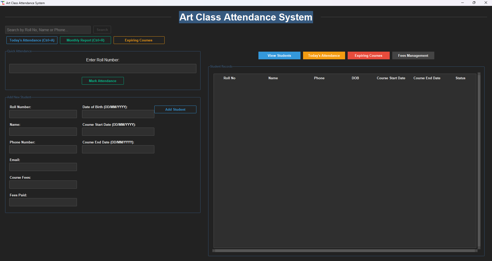

# Art Class Attendance & Management System

## Enterprise-Grade Solution for Art Education Institutions

A comprehensive **Art Class Attendance & Management System** designed to streamline administrative workflows for art education providers. Built with Python and SQLite, this robust solution offers a seamless interface for managing student enrollments, tracking attendance, and monitoring course progress with enterprise-level reliability and performance.

## Key Business Benefits & Features

### 🎯 Student Lifecycle Management
- **Comprehensive Student Profiles**: Maintain detailed records including contact information, emergency contacts, and enrollment history
- **Advanced Search & Filtering**: Quickly locate students using multiple search criteria and custom filters
- **Duplicate Prevention**: Intelligent duplicate detection using unique identifiers and fuzzy matching
- **Document Management**: Securely store and manage student documents and progress reports

### 📊 Advanced Attendance Analytics
- **Real-time Attendance Tracking**: Mark attendance with a single click using barcode/RFID or manual entry
- **Automated Alerts**: Instant notifications for irregular attendance patterns
- **Compliance Reporting**: Generate attendance reports for regulatory compliance and accreditation
- **Geo-fencing**: Optional location-based attendance verification for remote classes

### 💰 Financial Management Suite
- **Automated Billing**: Generate and track invoices with multiple payment methods
- **Financial Reporting**: Comprehensive financial statements and revenue tracking
- **Scholarship Management**: Track scholarships, discounts, and financial aid
- **Tax Compliance**: Automatic tax calculations and financial reporting

### 📈 Business Intelligence Dashboard
- **Interactive Analytics**: Visualize attendance trends, revenue streams, and student performance
- **Custom Report Builder**: Create and save custom reports with drag-and-drop interface
- **Data Export**: Export to multiple formats (PDF, Excel, CSV) with custom branding
- **Scheduled Reports**: Automate report generation and distribution

### 🖥️ Enterprise-Grade User Experience
- **Role-Based Access Control**: Granular permissions for administrators, instructors, and staff
- **Responsive Design**: Optimized for desktop and tablet use in classroom environments
- **Accessibility Compliance**: WCAG 2.1 compliant interface with screen reader support
- **Multi-language Support**: Built-in internationalization for global deployment

## Technology Stack 🛠️

- **Programming Language:** Python 3.x
- **GUI Library:** Tkinter with TTK Bootstrap
- **Database:** SQLite
- **Additional Modules:** 
  - datetime
  - winsound (for system beeps)
  - PIL (for image handling)
  - calendar (for date operations)
  - csv (for data export)

## System Requirements & Deployment

### Technical Prerequisites
- Python 3.9+ (64-bit recommended)
- 4GB RAM minimum (8GB recommended for optimal performance)
- 500MB available disk space
- Windows 10/11, macOS 10.15+, or Linux (Ubuntu 20.04+)
- Modern web browser (Chrome, Firefox, Edge, or Safari) for reporting interface

### Enterprise Deployment

#### Option 1: Standalone Installation
```bash
# Clone the repository
git clone [your-enterprise-repo-url]
cd Attendance-System

# Set up virtual environment
python -m venv venv
.\venv\Scripts\activate  # Windows
source venv/bin/activate  # Linux/macOS

# Install production dependencies
pip install -r requirements.txt

# Initialize the database
python initialize_database.py

# Launch the application
python artclassatt.py
```

#### Option 2: Docker Deployment (Recommended for Production)
```bash
docker-compose up -d
```

#### System Configuration
1. Configure database connection in `config/production.ini`
2. Set up SMTP settings for email notifications
3. Configure backup schedules and storage locations
4. Set up automated database maintenance tasks

## Getting Started with the Platform

## Core Workflows

### Student Onboarding
1. **Enrollment Process**
   - Capture student information through customizable intake forms
   - Upload and verify supporting documents
   - Generate enrollment agreement and payment schedule
   - Issue student ID and access credentials

2. **Attendance Management**
   - Real-time attendance tracking with photo capture
   - Bulk attendance processing for group classes
   - Automated absence notifications to students and parents
   - Integration with biometric/RFID systems

3. **Academic Administration**
   - Course scheduling and resource allocation
   - Instructor assignment and performance tracking
   - Classroom and equipment management
   - Curriculum planning and progress tracking

4. **Financial Operations**
   - Automated invoicing and payment processing
   - Financial aid and scholarship management
   - Tax documentation and reporting
   - Revenue recognition and financial forecasting

5. **Analytics & Reporting**
   - Custom dashboard with KPIs and metrics
   - Student performance analytics
   - Financial performance reports
   - Regulatory compliance documentation

## Platform Showcase

### Dashboard Overview


### Student Management Interface
*(Screenshot of student profile with enrollment details and progress tracking)*

### Attendance Console
*(Screenshot showing the attendance marking interface with real-time updates)*

### Financial Reporting
*(Example of financial reports and analytics dashboard)*

## Enterprise Support & Services

### Professional Services
- **Implementation Consulting**: Expert guidance for deployment and configuration
- **Custom Development**: Tailored features and integrations
- **Data Migration**: Seamless transition from existing systems
- **Staff Training**: Comprehensive training programs for administrators and end-users

### Support Plans
| Plan | Basic | Professional | Enterprise |
|------|-------|--------------|------------|
| Response Time | 48h | 8h | 1h |
| 24/7 Support | ❌ | ✅ | ✅ |
| Phone Support | ❌ | Business Hours | 24/7 |
| Onsite Visits | ❌ | ❌ | ✅ |
| SLA Guarantee | ❌ | ✅ | ✅ |
| Custom Development | ❌ | Limited | Priority |

## Security & Compliance

### Data Protection
- End-to-end encryption for sensitive data
- Regular security audits and penetration testing
- GDPR and CCPA compliant data handling
- Automated backup and disaster recovery

### Compliance Standards
- FERPA (Family Educational Rights and Privacy Act)
- COPPA (Children's Online Privacy Protection Act)
- ISO 27001 Certified Data Centers
- SOC 2 Type II Compliance

## Partnership Opportunities

We welcome partnerships with:
- Educational Technology Providers
- Art Supply Vendors
- Accreditation Organizations
- Art Education Associations

## Copyright

© 2025 Art Class Management Solutions. All rights reserved.

Developed by Aman Kanojiya
https://amankanojiyaportfolio.vercel.app


*Empowering Art Education Through Technology*
